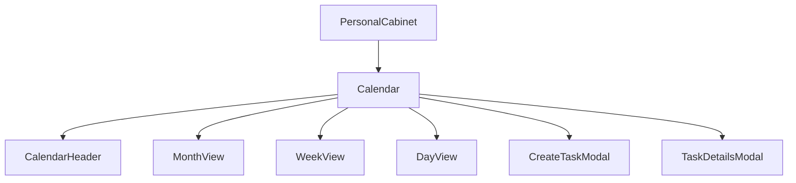

# Дизайн календаря в профиле сотрудника

Дизайн-документ описывает интеграцию и доработку календаря событий в профиле пользователя в соответствии с требованиями и макетом.

## Контекст и проблемы
1. **Отсутствие интеграции в профиль:** В личном кабинете (`PersonalCabinet.tsx`) вкладка "Календарь" отображает заглушку `DevelopmentStub`.
2. **Отсутствие месячной сетки:** Текущая реализация `CalendarGrid.tsx` отображает только вертикальную 24-часовую временную сетку (для недели), но не поддерживает классическую месячную сетку (grid 5x7 или 6x7), как показано на скриншоте.
3. **Нарушение лимитов строк:** `CalendarGrid.tsx` содержит 256 строк, что превышает лимит в 200 строк, установленный манифестом разработки.
4. **Недостаток функционала:** В интерфейсе просмотра событий отсутствует кнопка быстрого удаления событий (хотя в API есть поддержка мутаций).

## Предлагаемые решения и архитектура

Мы разделим отображение календаря на независимые, легковесные компоненты (каждый строго менее 200 строк):
1. **`Calendar.tsx`**: Корневой компонент. Загружает события с помощью хука `useCalendarEvents`, управляет модальными окнами (создание и детали задачи) и переключает режимы отображения.
2. **`CalendarHeader.tsx`**: Шапка календаря. Содержит переключатели режимов (День / Неделя / Месяц), навигацию (`<`, `>`, `Сегодня`) и кнопку создания события `+ Создать событие`.
3. **`MonthView.tsx`**: Компонент отображения сетки месяца (35 или 42 дня). Отрисовывает дни, выделяет сегодняшний день, выводит плашки событий с правильным цветом и временем. При клике на событие показывает всплывающее окно (Popover) с подробностями и кнопкой удаления.
4. **`WeekView.tsx`**: Отображение недели (вертикальная сетка 24 часа для 7 дней).
5. **`DayView.tsx`**: Отображение одного дня (вертикальная сетка 24 часа для 1 дня).

### Схема взаимодействия компонентов (Data Flow)

### Детали реализации MonthView (Сетка месяца)
- Вычисляется стартовый день сетки: `currentDate.startOf('month').startOf('isoWeek')`.
- Генерируется массив из 42 дней.
- Дни, не принадлежащие текущему месяцу, отображаются приглушенным цветом (opacity/text-slate-400).
- Текущий день подсвечивается зеленым кругом (или основным цветом темы).
- События дня фильтруются по дате `YYYY-MM-DD`.
- Каждое событие отображается как скругленная плашка с цветом `task.color` (например, `#29CC39` для зеленого, `#8833FF` для фиолетового) с временем и заголовком.
- Всплывающее окно (Popover) при нажатии на событие содержит:
  - Точку цвета события и название
  - Время (начало и конец) с иконкой часов
  - Дату с иконкой календаря
  - Описание события
  - Кнопку "Удалить" красного цвета с иконкой корзины. При клике вызывается мутация удаления, а кэш событий инвалидируется.
